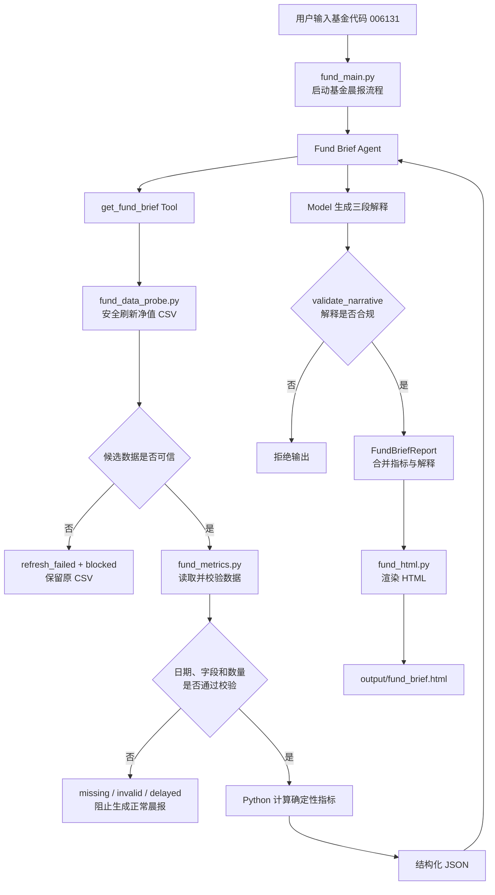

# 单基金研究晨报 Agent 架构

> 当前范围：基金 `006131` 的数据刷新、指标计算、Model 解释与 HTML 输出。

## 核心链路

## 模块职责

| 模块 | 职责 | 不负责 |
|---|---|---|
| `fund_data_probe.py` | 获取、清洗和安全替换基金净值 CSV | 不解释基金表现 |
| `fund_metrics.py` | 校验数据并计算确定性指标 | 不调用 Model，不给交易建议 |
| `fund_agent.py` | 注册 Tool，定义 Model 的三段输出结构和解释边界 | 不自行计算金融数字 |
| `fund_main.py` | 编排 Tool、Model、二次校验和文件输出 | 不绕过异常状态 |
| `fund_html.py` | 将通过校验的报告渲染成 HTML | 不修改指标或解释 |
| `tests/` | 验证指标、异常状态、刷新安全、文字边界和 HTML | 不调用付费 Model |

## 关键设计边界

1. **Python 负责事实**：数据日期、净值、涨跌幅、区间位置和最大回撤均由 Python 校验和计算。
2. **Model 负责解释**：Model 只比较已有指标并生成摘要、风险观察和行为提醒。
3. **Python 再次把关**：Model 复述具体数值、输出程序元话语、无依据标签或交易指令时，程序拒绝生成正常晨报。
4. **异常优先阻断**：刷新失败、数据缺失、格式非法、数量不足或数据延迟时，不生成看似正常的 HTML 晨报。

## 当前边界

- 只支持基金 `006131`；
- 新鲜度暂时按自然日判断；
- 本地 CSV 是实验数据样例，不是实时行情；
- 不预测未来涨跌，不连接交易账户，不自动交易；
- 真实 Model 端到端运行仍依赖外部 API。
